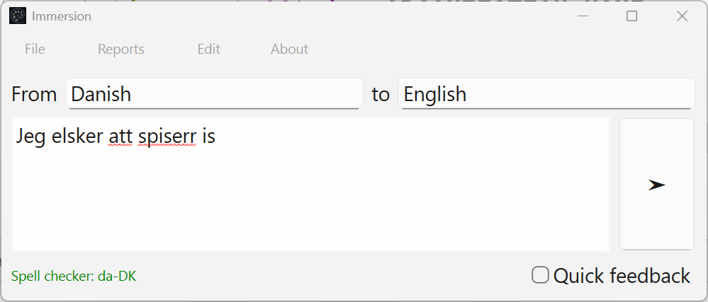
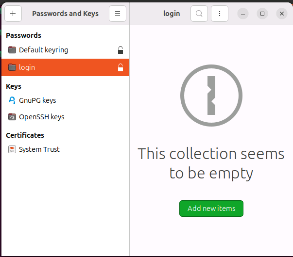

- [Immersion](#immersion)
	- [What It Does](#what-it-does)
	- [Installation](#installation)
		- [Windows](#windows)
		- [macOS](#macos)
		- [Linux](#linux)
	- [First Time Setup](#first-time-setup)
	- [How to Use](#how-to-use)
	- [Pro Tips](#pro-tips)
	- [Need Help?](#need-help)

# Immersion

**Write the language you want, everywhere**

Ever wanted to practice a new language but your audience does not speak it? Immersion has your back! Write in your target language, and it'll translate it to your audience's language while secretly teaching you from your mistakes.



## What It Does

- **Translates** your text to any language
- **Corrects** your mistakes (so you can learn from them)
- **Keeps history** of your recent inputs
- **Works everywhere** - translations are automatically copied to your clipboard

## Installation

### Windows
Download the latest release from [GitHub Releases](https://github.com/hytromo/immersion/releases) and run the installer.

### macOS
Download the latest release from [GitHub Releases](https://github.com/hytromo/immersion/releases) and drag to Applications.

### Linux
Download the `.flatpak` file from [GitHub Releases](https://github.com/hytromo/immersion/releases) and install it:
```bash
flatpak install immersion.flatpak
```

**Important for Linux users:** Make sure you have a "login" keyring set up in your system settings. If you don't see one, create it - it's where Immersion stores your API key securely.



## First Time Setup

1. Get an OpenAI API key from [OpenAI](https://platform.openai.com/api-keys)
2. Launch Immersion
3. Paste your API key when prompted (it's safely stored in your system's keychain)
4. Start writing in your target language!

## How to Use

1. Type or paste your text in the language you're learning
2. Select the source and target languages
3. Click "Go" or press Ctrl+Enter
4. The translation is automatically copied to your clipboard - just paste it wherever you need it
5. Check the corrections folder to see what you got wrong (and learn from it!)

## Pro Tips

- Use the history feature to see and reuse your recent inputs
- Generate reports to see your improvement over time
- Customize prompts and models in the settings menu

## Need Help?

Found a bug? Want to suggest a feature? Head over to the [GitHub Issues](https://github.com/hytromo/immersion/issues) page.

---

*Because learning a language shouldn't be scary - it should be immersive! 🌍* 